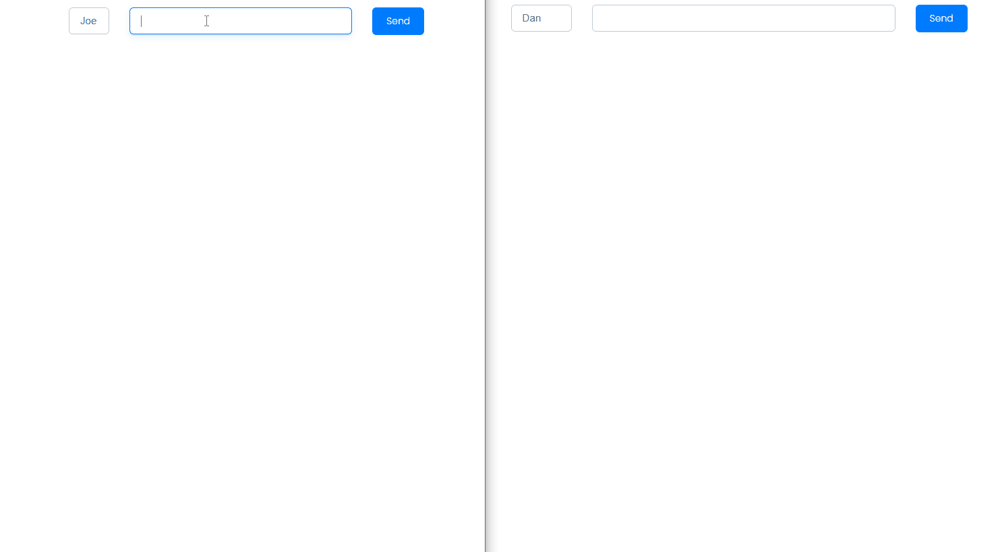

# simple-chat

A simple chat web-app built with React, GraphQL subscription and Apollo for learning Webpack5's Module Federation.

Client side is based on Jack Herrington's template: [https://github.com/jherr/wp5-starter-react](https://github.com/jherr/wp5-starter-react).

## Screenshot



## Install

```shell
cd ../server
yarn

cd client
yarn
```

## Startup

Terminate 1:

```shell
cd server
yarn start
```

```shell
cd client
yarn start
```
